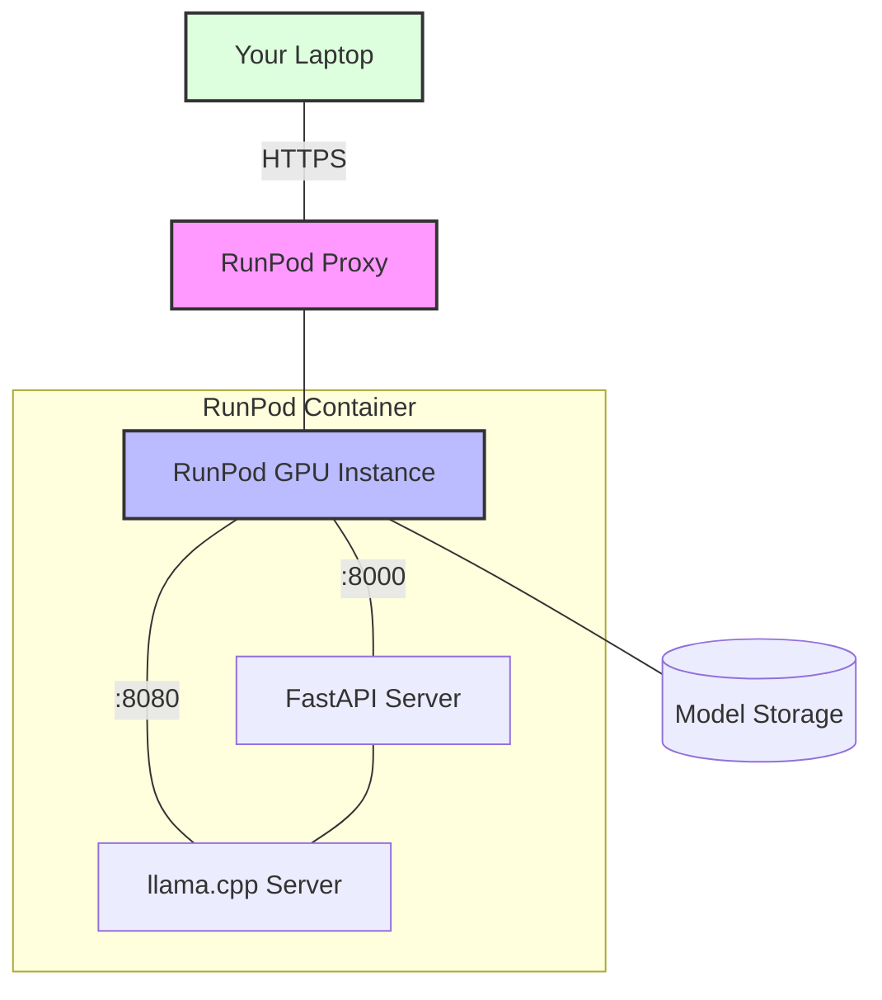

# DeepSeek Server

A GPU-accelerated server for running the DeepSeek R1 Distill Qwen 32B model using llama.cpp.

## Architecture



### Network Security
- HTTPS encryption via RunPod's proxy
- Authentication required for access
- Unique URL for each deployment
- Internal network isolation between pods

## Features

- GPU acceleration with CUDA 12.1.0
  - Optimized for A40 GPUs on RunPod
  - Full CUDA support in llama.cpp
  - Includes development tools for compilation
- FastAPI server for easy integration
- Automatic model downloading
- Secure HTTPS access via RunPod proxy

## Deployment

### 1. Prerequisites

1. [RunPod Account](https://runpod.io/) - You'll need credits for GPU usage
2. [GitHub Container Registry](https://ghcr.io) - The image is publicly available

### 2. Deploy on RunPod

1. Go to [RunPod Console](https://runpod.io/console/pods)
2. Click "Deploy" and then click "Edit Template" to enter the following Pod Template Overrides:
   ```
   GPU Type: NVIDIA A40
   Container Image: ghcr.io/rybruscoe/deepseek-server:latest
   ```

   Container Disk & Network Volume:
   ```
   Container Disk: 20GB
   Volume Disk: 100GB
   ```

   Volume Mount Path
   ```
   /app/models
   ```

   HTTP Port Settings:
    ```
    Expose HTTP Ports: 8000,8080
    ```
    Note: These ports will be accessible via:
    - API: https://[pod-id]-8000.proxy.runpod.net
    - LLM Server: https://[pod-id]-8080.proxy.runpod.net

3. Click "Set Overrides" and then "Deploy"

### 4. Verify Deployment

1. Wait for pod to start (~5 minutes for model download)
2. Check pod logs for:
   - "Downloading model..." message
   - "Server started successfully" message

3. Verify API access:
   - API endpoint: https://[pod-id]-8000.proxy.runpod.net
   - LLM Server: https://[pod-id]-8080.proxy.runpod.net

## API Usage

```python
import requests

response = requests.post(
    "https://[pod-id]-8000.proxy.runpod.net/v1/completions",
    json={
        "prompt": "Write a function that...",
        "temperature": 0.7,
        "max_tokens": 512
    }
)
print(response.json()["text"])
```

## Environment Variables

- `MODEL_PATH`: Path to the model file (defaults to `/app/models/deepseek-coder-33b-base.Q8_0.gguf`)

## GPU Optimization

### Memory Configuration

The server is optimized for A40 GPUs on RunPod with these parameters in `start.sh`:

```bash
# Optimized settings for A40 (48GB) with F16 model
--n-gpu-layers 80             # Maximum layer offload to GPU
--gpu-memory-utilization 0.9  # Use 90% of available VRAM
--ctx-size 32768             # Large context window
--batch-size 2048            # High throughput batch size
--threads 16                 # Optimal CPU thread usage
```

Recommended settings by GPU:

- **NVIDIA A40 (48GB)** - Production Settings:
  ```bash
  --n-gpu-layers 80
  --gpu-memory-utilization 0.9
  --ctx-size 32768
  --batch-size 2048
  ```

- **NVIDIA RTX 3090 (24GB)** - Development Settings:
  ```bash
  --n-gpu-layers 35
  --ctx-size 8192
  --batch-size 1024
  ```

- **NVIDIA RTX 4090 (24GB)** - Development Settings:
  ```bash
  --n-gpu-layers 35
  --ctx-size 8192
  --batch-size 1024
  ```

### Performance Tuning

Parameters that affect performance:
```bash
--threads 16            # CPU threads for parallel processing
--ctx-size 32768       # Context window size (affects memory usage)
--batch-size 2048      # Batch size for processing (affects throughput)
--temp 0.7             # Temperature for text generation
--repeat-penalty 1.1   # Penalty for repeated tokens
```

Tips for optimization:
- The A40 settings above are optimized for the F16 model in production
- For local development with Q4_K_M model, use the development settings
- Adjust `--gpu-memory-utilization` based on other running processes
- Monitor GPU memory usage and adjust if needed
- Use `--mlock` to prevent memory swapping

### Model Quantization

We support two quantization options in different branches:

#### Production Branch (master)
- **F16**: Full 16-bit precision for maximum quality
  - Recommended for production use on A40/A100 GPUs
  - Larger model size (~32GB)
  - Best inference quality
  - Higher VRAM requirements

#### Local Development Branch (local-dev)
- **Q4_K_M**: 4-bit quantization for testing
  - Suitable for development on consumer GPUs (e.g., RTX 3090)
  - Smaller model size (~8GB)
  - Good enough quality for testing
  - Lower VRAM requirements

To switch between versions:
```bash
# For local development with Q4_K_M
git checkout local-dev

# For production with F16
git checkout master
```

## License

MIT License - See [LICENSE](LICENSE) for details. 