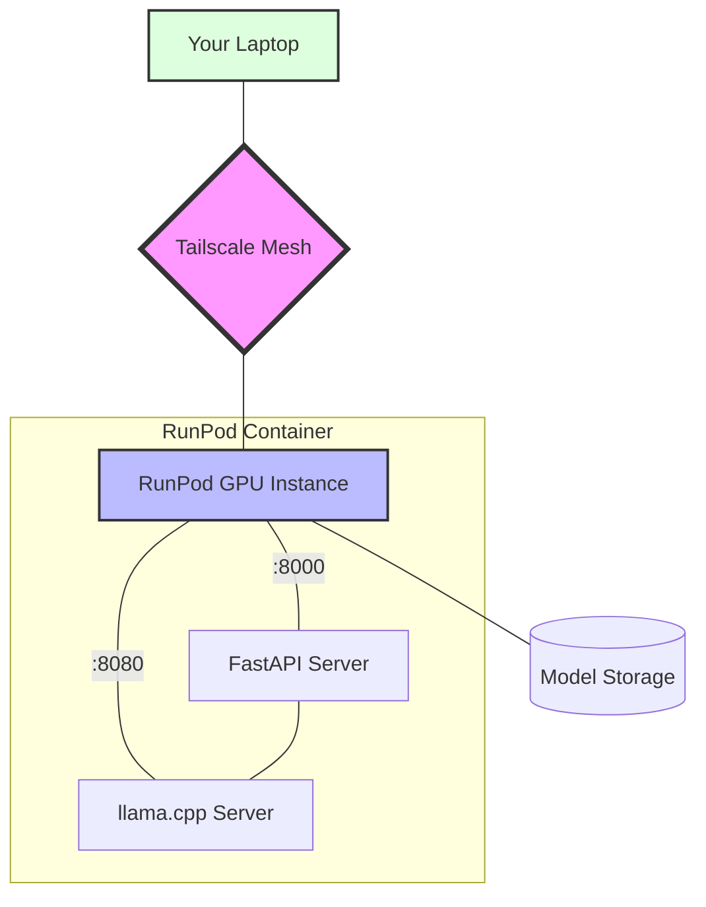

# DeepSeek Server

A GPU-accelerated server for running the DeepSeek Coder model using llama.cpp.

## Architecture



### Network Security
- Tailscale creates an encrypted mesh network between your devices
- All traffic is end-to-end encrypted
- No need to expose public ports
- Each device has a unique identity and access can be revoked

## Features

- GPU acceleration with CUDA support
- GPU acceleration with CUDA 12.1.0
  - Optimized for A40 GPUs on RunPod
  - Full CUDA support in llama.cpp
  - Includes development tools for compilation
- FastAPI server for easy integration
- Automatic model downloading
- Tailscale VPN integration for secure access

## Deployment

### 1. Prerequisites

1. [Tailscale Account](https://tailscale.com/) - Sign up if you haven't already
2. [RunPod Account](https://runpod.io/) - You'll need credits for GPU usage
3. [GitHub Container Registry](https://ghcr.io) - The image is publicly available

### 2. Get Tailscale Auth Key

1. Go to [Tailscale Admin Console](https://login.tailscale.com/admin/settings/keys)
2. Click "Generate auth key"
3. Set expiry (e.g., 90 days)
4. Configure key settings:
   ```
   Type: One-off (recommended for security)
   Expiry: 90 days
   Tags: Optional (e.g., "runpod")
   Reusable: No (one-off keys are more secure)
   Ephemeral: Yes (pod will be removed from devices list when stopped)
   ```
4. Copy the auth key (starts with `tskey-auth-`)

> **Security Note**: One-off keys can only be used once and are automatically invalidated after use. 
> If you destroy and recreate your pod, you'll need to generate a new auth key. 
> This is more secure than using reusable keys as it limits the window of potential compromise.

### 3. Deploy on RunPod

1. Go to [RunPod Console](https://runpod.io/console/pods)
2. Click "Deploy"
3. Basic Settings:
   ```
   GPU Type: NVIDIA A40
   Container Image: ghcr.io/rybruscoe/deepseek-server:latest
   ```

4. Environment Variables:
   - Click "Add Environment Variable"
   - Add:
   ```
   Name: TS_AUTHKEY
   Value: your-tailscale-auth-key
   ```
   Can leave the OLLAMA_MODELS path or remove it as it won't be used.

5. Container Disk & Network Volume:
   ```
   Container Disk: 20GB
   Volume Disk: 100GB
   ```

6. Volume Mount Path
   ```
   /app/models
   ```

7. Container Runtime Settings:
   ```
   NET_ADMIN,NET_RAW
   ```
   Note: These specific capabilities are required for Tailscale networking

8. Container Start Command:
   ```
   Leave this empty (do not put --gpus all here)
   ```
   Note: GPU access is handled automatically by RunPod's template

9. HTTP Port Settings:
   ```
   Expose HTTP Ports: 8000,8080
   ```
   - Port 8000: FastAPI server
   - Port 8080: llama.cpp server
   Note: These ports are only needed if you want direct HTTP access. 
   When using Tailscale, no additional port configuration is required.

10. Click "Deploy"

### 4. Verify Deployment

1. Wait for pod to start (~5 minutes for model download)
2. Check pod logs for:
   - "Downloading model..." message
   - "Starting Tailscale..." message
   - "Server started successfully" message

3. Verify Tailscale connection:
   - Your pod will appear in Tailscale admin console as "llm-gpu-pod"
   - From your local machine: `ping llm-gpu-pod`
   - Or check pod status: `tailscale status` in pod shell

## API Usage

```python
import requests

response = requests.post(
    "http://llm-gpu-pod:8000/v1/completions",
    json={
        "prompt": "Write a function that...",
        "temperature": 0.7,
        "max_tokens": 512
    }
)
print(response.json()["text"])
```

## Environment Variables

- `TS_AUTHKEY`: Tailscale authentication key (required for VPN access)
- `MODEL_PATH`: Path to the model file (defaults to `/app/models/deepseek-coder-33b-base.Q8_0.gguf`)

## GPU Optimization

### Memory Configuration

The server can be optimized for different GPU configurations by adjusting these parameters in `start.sh`:

```bash
# Memory usage (adjust based on your GPU)
--n-gpu-layers 80        # Number of layers to offload to GPU
--gpu-memory-utilization 0.9  # GPU memory usage (0.0 to 1.0)
```

Recommended settings by GPU:
- **NVIDIA A40 (48GB)**:
  ```
  --n-gpu-layers 80
  --gpu-memory-utilization 0.9
  ```
- **NVIDIA A5000 (24GB)**:
  ```
  --n-gpu-layers 60
  --gpu-memory-utilization 0.8
  ```
- **NVIDIA A4000 (16GB)**:
  ```
  --n-gpu-layers 40
  --gpu-memory-utilization 0.7
  ```

### Performance Tuning

Other parameters that affect performance:
```bash
--threads 8             # CPU threads for non-GPU operations
--ctx-size 8192        # Context window size
--batch-size 1024      # Batch size for processing
```

Tips for optimization:
- Increase `--threads` on machines with more CPU cores
- Reduce `--ctx-size` if running out of memory
- Adjust `--batch-size` based on your use case:
  - Larger for throughput
  - Smaller for lower latency

### Model Quantization

We use Q8_0 quantization for optimal quality, but other options are available:
- **Q8_0**: Best quality, largest size
- **Q6_K**: Good balance of quality and size
- **Q4_K_M**: Smallest size, lower quality

To use a different quantization, update `MODEL_URL` in `download_model.sh`.

## License

MIT License - See [LICENSE](LICENSE) for details. 