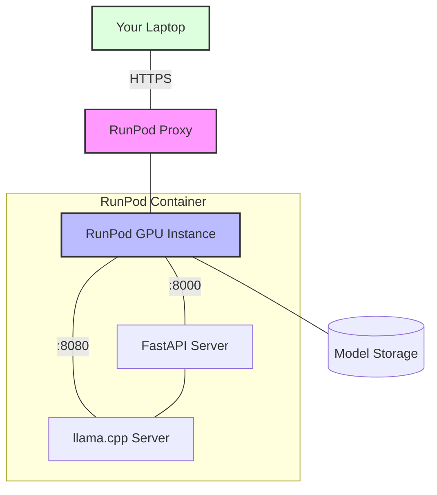

# DeepSeek Server

A GPU-accelerated server for running the DeepSeek Coder model using llama.cpp.

## Architecture



### Network Security
- HTTPS encryption via RunPod's proxy
- Authentication required for access
- Unique URL for each deployment
- Internal network isolation between pods

## Features

- GPU acceleration with CUDA 12.1.0
  - Optimized for A40 GPUs on RunPod
  - Full CUDA support in llama.cpp
  - Includes development tools for compilation
- FastAPI server for easy integration
- Automatic model downloading
- Secure HTTPS access via RunPod proxy

## Deployment

### 1. Prerequisites

1. [RunPod Account](https://runpod.io/) - You'll need credits for GPU usage
2. [GitHub Container Registry](https://ghcr.io) - The image is publicly available

### 2. Deploy on RunPod

1. Go to [RunPod Console](https://runpod.io/console/pods)
2. Click "Deploy" and then click "Edit Template" to enter the following Pod Template Overrides:
   ```
   GPU Type: NVIDIA A40
   Container Image: ghcr.io/rybruscoe/deepseek-server:latest
   ```

   Container Disk & Network Volume:
   ```
   Container Disk: 20GB
   Volume Disk: 100GB
   ```

   Volume Mount Path
   ```
   /app/models
   ```

   HTTP Port Settings:
    ```
    Expose HTTP Ports: 8000,8080
    ```
    Note: These ports will be accessible via:
    - API: https://[pod-id]-8000.proxy.runpod.net
    - LLM Server: https://[pod-id]-8080.proxy.runpod.net

3. Click "Set Overrides" and then "Deploy"

### 4. Verify Deployment

1. Wait for pod to start (~5 minutes for model download)
2. Check pod logs for:
   - "Downloading model..." message
   - "Server started successfully" message

3. Verify API access:
   - API endpoint: https://[pod-id]-8000.proxy.runpod.net
   - LLM Server: https://[pod-id]-8080.proxy.runpod.net

## API Usage

```python
import requests

response = requests.post(
    "https://[pod-id]-8000.proxy.runpod.net/v1/completions",
    json={
        "prompt": "Write a function that...",
        "temperature": 0.7,
        "max_tokens": 512
    }
)
print(response.json()["text"])
```

## Environment Variables

- `MODEL_PATH`: Path to the model file (defaults to `/app/models/deepseek-coder-33b-base.Q8_0.gguf`)

## GPU Optimization

### Memory Configuration

The server can be optimized for different GPU configurations by adjusting these parameters in `start.sh`:

```bash
# Memory usage (adjust based on your GPU)
--n-gpu-layers 80        # Number of layers to offload to GPU
--gpu-memory-utilization 0.9  # GPU memory usage (0.0 to 1.0)
```

Recommended settings by GPU:
- **NVIDIA A40 (48GB)**:
  ```
  --n-gpu-layers 80
  --gpu-memory-utilization 0.9
  ```
- **NVIDIA A5000 (24GB)**:
  ```
  --n-gpu-layers 60
  --gpu-memory-utilization 0.8
  ```
- **NVIDIA A4000 (16GB)**:
  ```
  --n-gpu-layers 40
  --gpu-memory-utilization 0.7
  ```

### Performance Tuning

Other parameters that affect performance:
```bash
--threads 8             # CPU threads for non-GPU operations
--ctx-size 8192        # Context window size
--batch-size 1024      # Batch size for processing
```

Tips for optimization:
- Increase `--threads` on machines with more CPU cores
- Reduce `--ctx-size` if running out of memory
- Adjust `--batch-size` based on your use case:
  - Larger for throughput
  - Smaller for lower latency

### Model Quantization

We use Q8_0 quantization for optimal quality, but other options are available:
- **Q8_0**: Best quality, largest size
- **Q6_K**: Good balance of quality and size
- **Q4_K_M**: Smallest size, lower quality

To use a different quantization, update `MODEL_URL` in `download_model.sh`.

## License

MIT License - See [LICENSE](LICENSE) for details. 